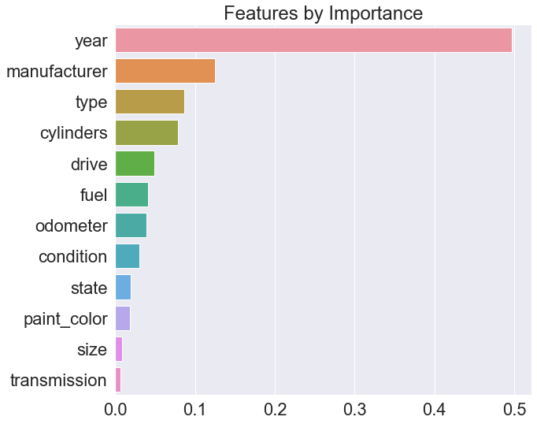

## What drives the price of a car?

### Goal

To understand the factors that make a car more or less expensive. Also, to provide clear recommendations to client - a used car dealership as to what consumers value in a used car.

### Methodology

Please refer to [python notebook](./notebook.ipynb) for technical details on the analysis. 

We have used an industry standard process called [CRISP-DM](https://mo-pcco.s3.us-east-1.amazonaws.com/BH-PCMLAI/module_11/readings_starter.zip) to analyze the [used cars dataset](./data/vehicles.csv) provided to us.

### Findings and Results

Based on our analysis, these are the most important features of a used car that affect the price

**Year of Manufacture**: There is a strong positive correlation between the car's year of manufacture and the price. Newer the car, higher the price. This is one metric which has the greatest influence on the car's price.

**Manufacturer**: Cars from certain manufacturers like Ferari tend to be expensive compared to morgan and mercury. Resale value basically depends on the manufacturer.

**Type**: Type of the car (SUV, Sedan, Minivan etc.,) is the next biggest influence on resale value, in general price also depends on this

**Cylinders**: Number of cylinders has a positive correlation with the price, as higher cylinders, mean usually more power and consequently more price

**Dive**: AWD cars tend influence price more than the FWD and RWD

Most cars in the dataset tend to be in `excellent`, `like new` or `good` condition, that is why they tend not to have strong influence in the ultimate price, which was counter intutive.

The least important features were **size** and **transmission**. Correlation of **size** was better captured by the **type**, **cylinders** and **drive** which is why it didn't have a significant correlation by itself, also most vehicles had `automatic` transmission and thus did not significantly influence price there as well

### Notebook

#### [Jupyter Notebook used for Analysis](notebook.ipynb)

