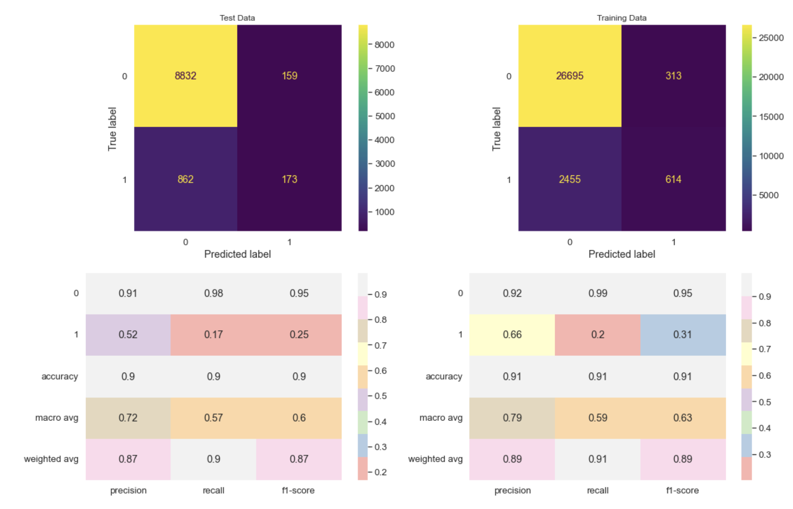
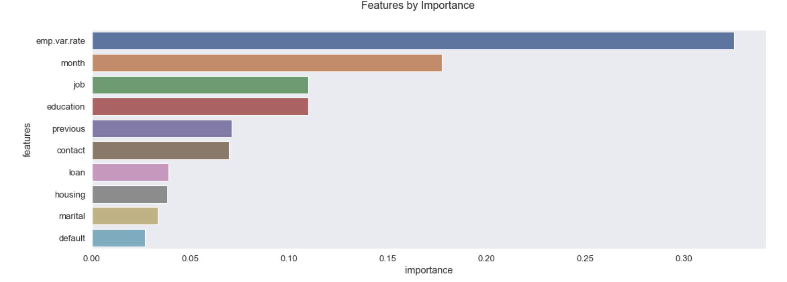
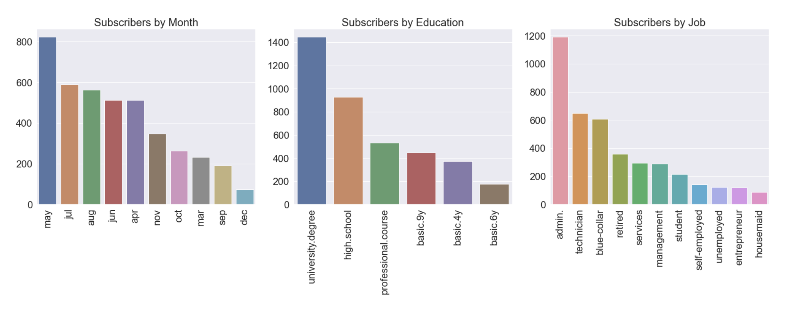

## What drives the client to do a term deposit?

### Goal

Business Objective of the task is to identify a model that can successfully predict whether a client will subscribe to the term deposit given a set of features. Also determine which features have the most impact on clients decision to subscribe to the term deposit.


### Methodology

Please refer to [python notebook](./notebook.ipynb) for technical details on the analysis. 

We have used an industry standard process called [CRISP-DM](https://mo-pcco.s3.us-east-1.amazonaws.com/BH-PCMLAI/module_11/readings_starter.zip) to analyze the [bank data set](./data/bank-additional-full.csv) provided to us from the UCI Machine Learning repository [link](https://archive.ics.uci.edu/ml/datasets/bank+marketing).

### Findings

Based on the above analysis **Decision Tree Classifier** seems to be the best model for accurately predicting whether a subscriber will respond positively to a campaign for long term deposit 

This model has the best performance metrics with the below hyper parameters

```
{'criterion': 'gini', 'max_depth': 10, 'max_features': 'sqrt', 'splitter': 'best'}
```


The most important features that is impactful on the campaign are as shown below



**Employment Variation Rate**: This is an indicator of how many people are hired or fired in a quarterly basis, is a key indicator for the health of a business. Higher this number, lower the possibility of a term deposit as the business is undergoing churn.

**Month**: Month in which we contact the customer has a higher impact, this is most likely because they have greater cash flows during those monthsespecially around quarter ends when there are more cash lying around to invest

**Job** and **Education**: Job and Education has strong correlation with the outcome, with admin jobs and university degree holders willing to invest into term deposit



#### Next Steps and Recommendations

Based on the above findings newer campaigns should follow these recommendations

* Avoid businesses that have high rate of churn, with more people hired and fired, they have way less cash to carry around
* Target campaigns on certain month that have the highest yeild
* Well educated people are more likely to invest in term deposit
* People in more stable jobs are more likely to invest in term deposit

### Notebook

#### [Jupyter Notebook used for Analysis](notebook.ipynb)

